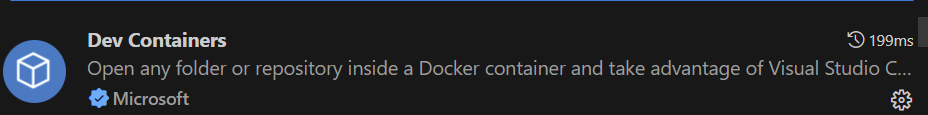

# DevContainerRESTBackend
REST- Backend in .NET using  devcontainer to setup the development enviroment.

# Intro
This repository is intended for proviing an example of a dev container environment via Microsoft Visual Studio Code. 

# Prerequsits 
Docker Desktop  
Visual Studio Code 
   - Extension Dev Containers
   

# HowTo
1. Clone this repository
2. Open folder in press button "Reopen in Container" in the form in the bottom left.

